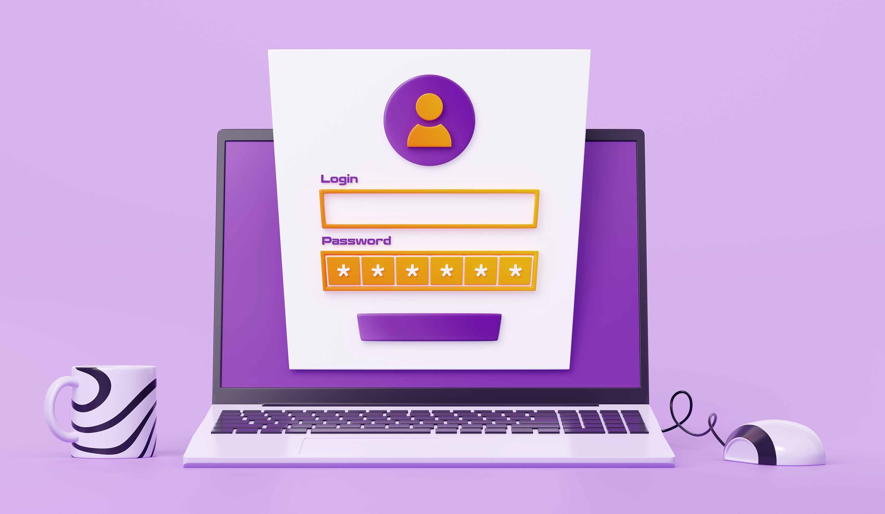
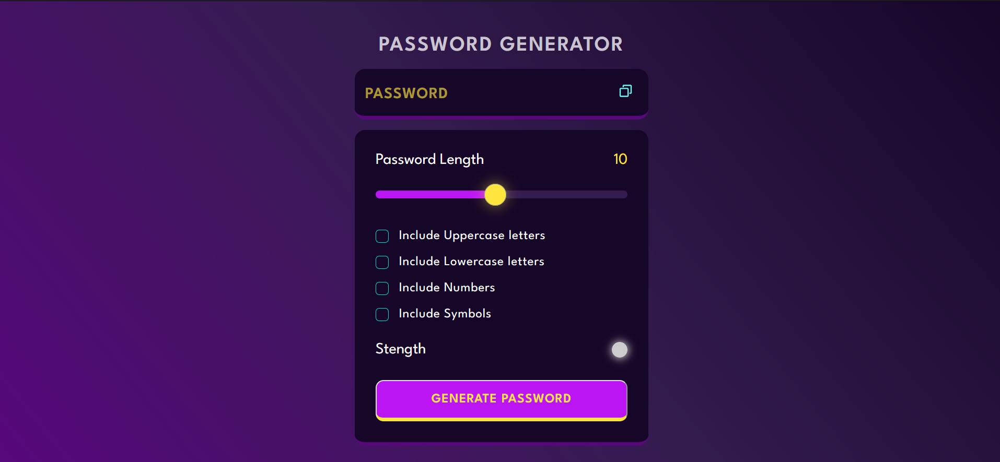
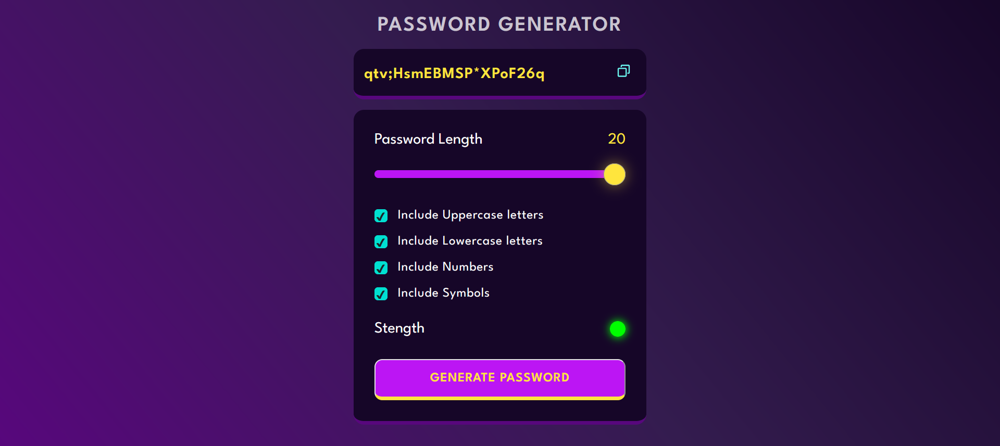

# <b> CyberShield </b> (Password Generator) 

## <b> Overview </b>

A secure and user-friendly password generator tool that helps you generate strong passwords for your online accounts. It allows you to customize your passwords by selecting options for uppercase letters, lowercase letters, numbers, and special characters. You can also choose the length of the password (between 8 and 128 characters) to create a unique and complex password that meets your requirements.

### <b> Features </b>

- Customizable options for generating passwords (uppercase letters, lowercase letters, numbers, and special characters)
- Ability to set password length between 8 and 128 characters
- Secure password generation algorithm that creates unique and complex passwords
- User-friendly interface that makes it easy to generate passwords quickly
- Cross-browser compatibility (works on all modern browsers)

### <b> Screenshots </b>

## <b> Usage </b>

To generate a password using the Password Generator Tool, follow these steps:

1. Go to the [Password Generator website](https://password-auto-genarator.netlify.app)
2. Select the options for your desired password (uppercase letters, lowercase letters, numbers, and special characters)
3. Use the slider to select the length of your desired password (between 8 and 128 characters)
4. Click on the "Generate Password" button to generate a new password
5. Copy the generated password and use it for your account

